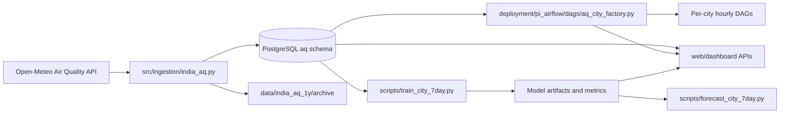

# Final Year Air Quality Platform

This repository is an end-to-end air quality forecasting platform with:
- multi-city data ingestion from Open-Meteo
- PostgreSQL incremental storage and watermarks
- Airflow city-isolated scheduling on Raspberry Pi
- model training and forecasting scripts
- a Next.js dashboard for status, lineage, observations, and DAG alerts

## 1) What This Codebase Contains

There are three major code domains in this repository:

1. Project code (the core platform): `src/`, `scripts/`, `tests/`, `web/dashboard/`, `deployment/pi_airflow/`
2. Data and artifacts: `data/`, model checkpoints (`*.pth`), arrays (`*.npy`), CSV outputs
3. Embedded external graph stacks: `deployment/graphify/` and `deployment/graphiti/`

Important: Graphify analysis in this repo can be dominated by the embedded `graphify` and `graphiti` source trees because they are large. For project work, prioritize `src/`, `scripts/`, `deployment/pi_airflow/`, and `web/dashboard/`.

## 2) High-Level Architecture



## 3) Top-Level Repository Map (What Is What)

| Path | Purpose |
|---|---|
| `src/` | Core Python package for ingestion, preprocessing, model definitions, evaluation, integrations |
| `scripts/` | Operational CLI scripts (download, analyze, bootstrap DB, train, forecast, sync, monitor) |
| `deployment/pi_airflow/` | Airflow deployment for Raspberry Pi, including city DAG factory and SQL bootstrap |
| `web/dashboard/` | Next.js dashboard + API routes + dashboard data assembly |
| `tests/` | Python tests for ingestion and DAG factory behavior |
| `data/` | Raw and processed datasets (Hyderabad station set, India multi-city set, archives, notes) |
| `graphify-out/` | Generated graph outputs: `graph.json`, `GRAPH_REPORT.md`, visualization/wiki artifacts |
| `deployment/graphify/` | Embedded Graphify project (knowledge graph tooling and MCP surface) |
| `deployment/graphiti/` | Embedded Graphiti project (temporal graph memory + MCP server) |
| root notebooks (`phase*.ipynb`, `thesis_plots.ipynb`) | Research and experiment notebooks |
| root model/artifact files (`*.pth`, `*.pkl`, `*.npy`, `*.csv`) | Trained models, scalers, feature names, train/test arrays and outputs |

## 4) Core Python Package Map (`src/`)

### `src/ingestion/india_aq.py`
Main ingestion engine.
- Defines `IngestionSettings` from env
- Creates and manages `aq` schema/tables (`cities`, `city_watermarks`, `ingestion_runs`, `observations`)
- Fetches city-level hourly history from Open-Meteo
- Runs incremental windows with overlap based on watermarks
- Archives per-city run snapshots to gzip CSV
- Upserts observations idempotently
- Records ingestion run metadata and failure details

Key workflows:
- `run_incremental_cycle_for_cities(...)`
- `run_incremental_cycle_for_city(...)`
- `bootstrap_csv_to_postgres(...)`

### `src/data/cities.py`
City catalog and helpers.
- `City` dataclass
- India + global major city lists
- `city_by_slug()`, `city_catalog()`, `dag_id_for_city(...)`

### `src/data/live_air_quality.py`
Live/history fetch utilities against Open-Meteo.
- `fetch_city_history(...)`
- `fetch_latest_city_observation(...)`

### `src/data/preprocess.py`
Preprocessing pipeline driven by `config.yaml`.
- datetime normalization
- optional winsorization
- outlier handling (`iqr` or threshold)
- missing-value interpolation and fill
- resampling (for example, to 15-minute cadence)

### `src/data/dataset.py`
Dataset builder for model training.
- chronological train/val/test split
- scaler fit/apply (`standard`, `robust`, `minmax`, or none)
- sliding window generation for supervised forecasting arrays

### `src/models/transformers.py`
Transformer-based forecasting models.
- `TransformerForecaster`
- `RTTransformerForecaster` (local causal attention window)
- positional encoding and forecast head modules

### `src/evaluation/metrics.py`
Forecast metric utilities.
- RMSE, MAE, R2
- MASE
- quantile pinball loss
- prediction interval coverage

### `src/integrations/thingspeak.py`
ThingSpeak publishing integration.
- `ThingSpeakClient`
- retry-aware publish and typed result object

### `src/utils/seed.py`
Seed and reproducibility utility support.

## 5) Script Map (`scripts/`)

| Script | Purpose |
|---|---|
| `download_india_air_quality.py` | Pull multi-city India air-quality data and persist CSV outputs |
| `analyze_india_aq.py` | Generate completeness, monthly trends, stats, and quality notes for India dataset |
| `fetch_hyderabad_station_data.py` | Pull station-level Hyderabad data targets |
| `analyze_hyderabad_station_data.py` | Station-level Hyderabad analysis outputs |
| `bootstrap_india_aq_db.py` | Initialize and seed PostgreSQL `aq` schema from archived CSV data |
| `train_city_7day.py` | Train 7-day city forecasting models |
| `forecast_city_7day.py` | Generate next-7-day forecasts from trained city model artifacts |
| `monitor_and_retrain.py` | Check drift/performance and trigger retrain flow when thresholds are exceeded |
| `pi_runtime_loop.py` | Continuous Raspberry Pi runtime loop for forecasting operation |
| `sync_india_air_quality_to_thingspeak.py` | Push city AQ samples to ThingSpeak channels |
| `migrate_aggregates.py` | Aggregate migration/maintenance utility |

## 6) Airflow Deployment (`deployment/pi_airflow/`)

### DAG factory
- `deployment/pi_airflow/dags/aq_city_factory.py` dynamically creates one DAG per city from `ALL_MAJOR_CITIES`
- schedule: hourly (`0 * * * *`)
- each DAG runs a city-specific ingestion callable
- city isolation means one failing city run does not block all others

### Supporting assets
- `deployment/pi_airflow/docker-compose.yml` for Airflow stack deployment
- `deployment/pi_airflow/sql/` for database bootstrap/init SQL

## 7) Dashboard (`web/dashboard/`)

The dashboard is a Next.js app exposing both UI and operational APIs.

Main API routes:
- `/api/status`: consolidated dashboard snapshot
- `/api/graph`: lineage graph projection used by UI
- `/api/observations`: ranked latest observations for all cities
- `/api/observations/[citySlug]`: city-level metrics, trends, AQI category, health advisory
- `/api/dag-alerts`: pulls DAG run state and failures from Airflow API
- `/api/tree`: safe repository tree listing
- `/api/file`: guarded file preview endpoint

Operational notes:
- Airflow credentials and base URL are read from environment
- route handlers return structured JSON with guarded error handling

## 8) Tests

- `tests/test_india_aq.py`: ingestion/data logic verification
- `tests/test_aq_city_factory.py`: DAG factory generation checks

Run tests:
```bash
conda run -n dl-env python -m pytest -q
```

## 9) Data and Model Artifacts

Common root artifacts:
- model checkpoints: `lstm_model.pth`, `bilstm_model.pth`, `cnn_model.pth`, `tcn_model.pth`
- tabular/model assets: `scaler*.pkl`, `feature_names*.pkl`
- arrays: `X_train*.npy`, `X_test*.npy`
- labels/outputs: `y_train*.csv`, `y_test*.csv`, `results.csv`

Main dataset folders:
- `data/hyderabad_station_aq_1y/`
- `data/india_aq_1y/`

## 10) Graphify View of This Repository

This repository already has graph outputs at `graphify-out/`:
- `graphify-out/graph.json`
- `graphify-out/GRAPH_REPORT.md`

Current graph summary (latest report):
- 5137 nodes
- 16230 edges
- 76 detected communities

Graphify-guided usage in this repo:
```bash
conda run -n dl-env graphify update .
conda run -n dl-env graphify query "<question>" --graph graphify-out/graph.json
conda run -n dl-env graphify path "A" "B" --graph graphify-out/graph.json
```

Practical guidance:
- Use Graphify to answer architecture and dependency questions quickly.
- For project-specific work, filter mentally to `src/`, `scripts/`, `web/dashboard/`, and `deployment/pi_airflow/` because embedded `deployment/graphify/` and `deployment/graphiti/` are large and can dominate global graph results.

## 11) Quickstart

### Python environment
```bash
conda activate dl-env
python -m pip install -r requirements.txt
```

### Dashboard
```bash
cd web/dashboard
npm install
npm run dev
```

### Ingestion (example)
```bash
conda run -n dl-env python scripts/download_india_air_quality.py
conda run -n dl-env python scripts/bootstrap_india_aq_db.py
```

### Train and forecast (example)
```bash
conda run -n dl-env python scripts/train_city_7day.py --help
conda run -n dl-env python scripts/forecast_city_7day.py --help
```

## 12) Scope Clarification

If your task is the air-quality platform itself, start here:
- `src/`
- `scripts/`
- `deployment/pi_airflow/`
- `web/dashboard/`
- `tests/`

Use these only when working on graph tooling/memory infra:
- `deployment/graphify/`
- `deployment/graphiti/`
